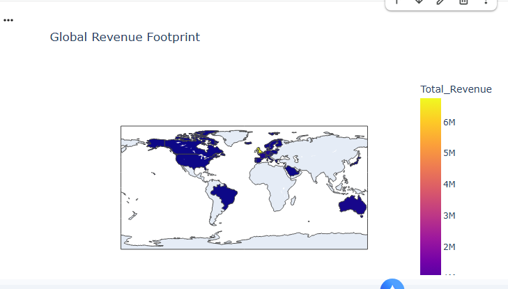

# Customer-lifecycle-and-profitability-audit
End-to-end retail data audit using SQL and RFM modeling to identify high-value customer segments.

🎯 Project Overview
This project involves a comprehensive audit of a UK-based online retail dataset. The goal was to transition from raw, messy transaction data to a structured Star Schema database and eventually a high-level Customer Loyalty (RFM) Model.

By the end of the audit, I successfully categorized 4,372 unique customers into actionable segments to guide marketing and retention strategies.

🛠️ Tech Stack
Language: Python (Pandas, NumPy)
Database: SQL (SQLite)
Visualization: Plotly, Seaborn, Matplotlib
Methodology: RFM Modeling (Recency, Frequency, Monetary)

Phase 1: Data Engineering & Star Schema
Before analysis, I cleaned the data (handling missing values and negative quantities) and engineered a Star Schema to optimize query performance.

Fact Table: fact_sales (Transactions, Revenue)

Dimension Tables: dim_customers (Geography), dim_products (Descriptions), dim_datetime (Temporal trends)

🔬 Phase 2: RFM Modeling Logic
I developed a scoring system (1-5) for three key behavioral metrics:

Recency: Days since the last purchase (identifies churn risk).
Frequency: Total number of unique orders (identifies loyalty).
Monetary: Total lifetime spend (identifies value).

Key Finding: The "Pareto Principle" was evident; a small percentage of "Champions" contributed to a majority of the total revenue.

📈 Phase 3: Strategic Insights
Using Regular Expressions (Regex), I mapped scores to human-readable segments:

Segment,Strategy
Champions,Reward with VIP status and early access.
Can't Lose Them,Urgent win-back campaign; identified as high-value lapsed fans.
New Customers,Onboarding sequence to encourage a second purchase.
Hibernating,Low priority; focus marketing spend elsewhere.

Key Results & Business Impact
Revenue Concentration: Discovered that Champions spend an average of £6,527, compared to the site-wide median of £648.
Churn Recovery: Identified a specific group of 69 "Can't Lose Them" customers who represent significant recoverable revenue.
Inventory Optimization: Analyzed "Champion" product affinity to suggest cross-selling opportunities for new users.

📂 How to Run
Clone the repository.
Install requirements: pip install pandas plotly seaborn.
Open Customer_lifecycle.ipynb in Google Colab or Jupyter.

## Business Insights
Below is the distribution of our customer segments,global revenue distribution,Percentage of Total Revenue by RFM Segment:

